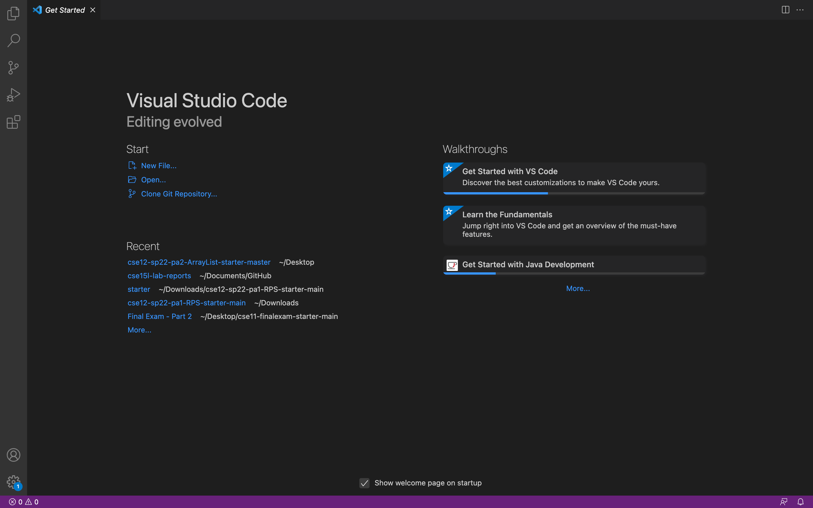
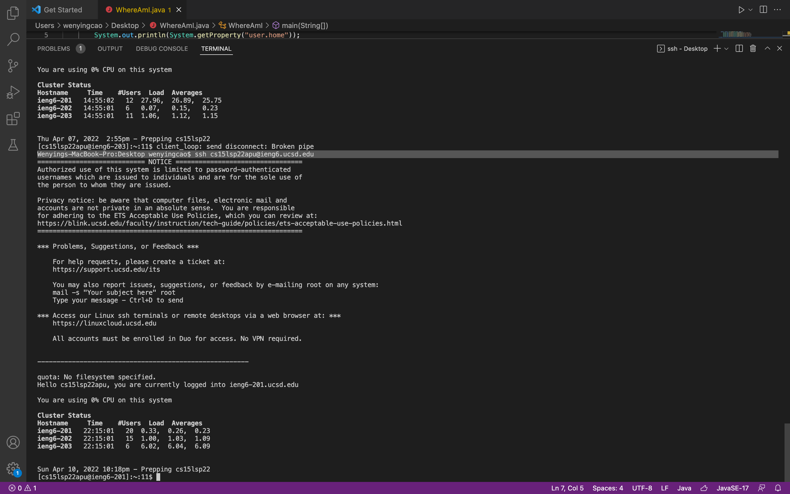
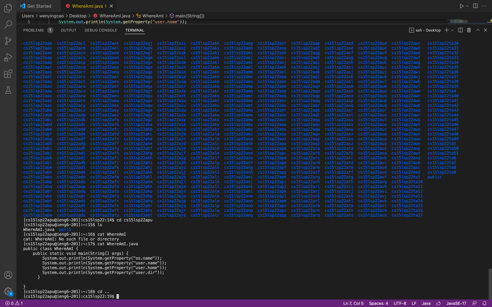
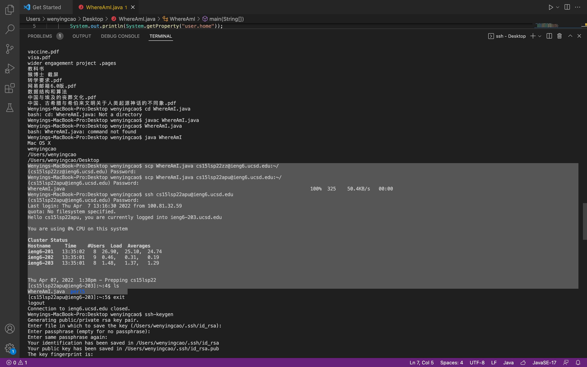
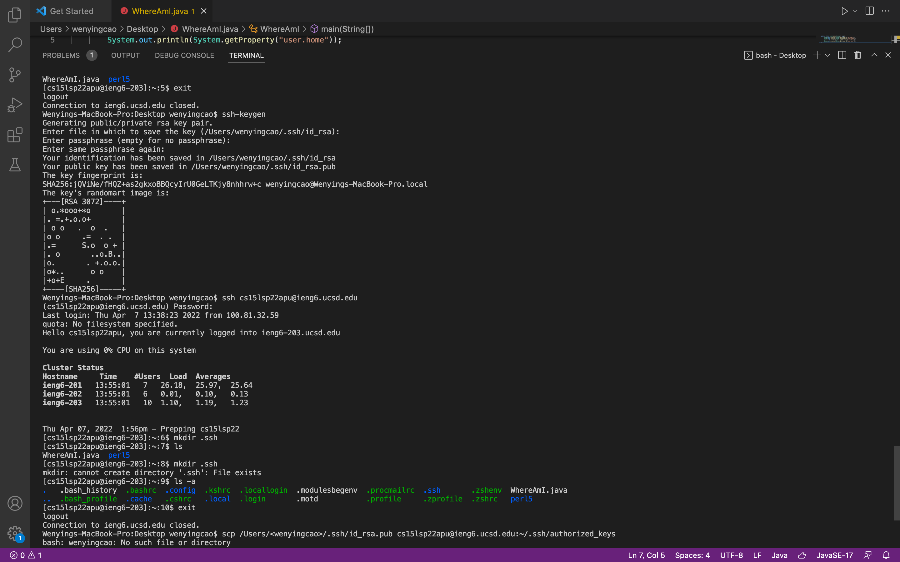
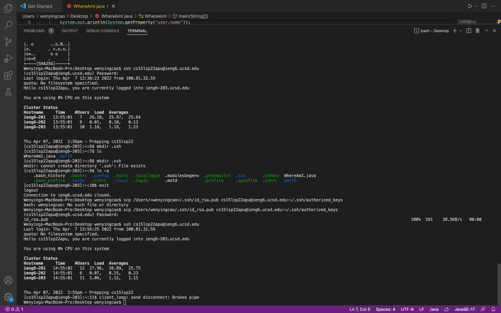
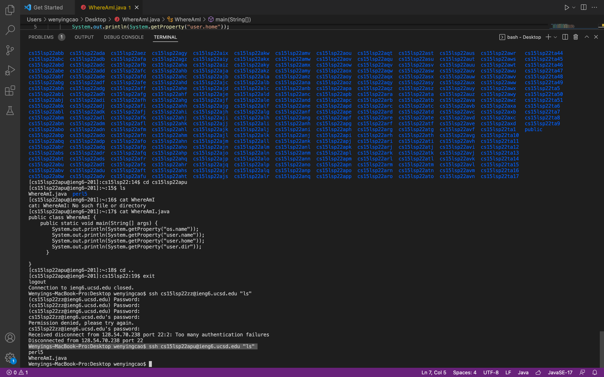

# Week 2 Lab Report-remote access
## Installing VScode
The first step is to install visual studio code. Be aware the difference between **visual studio code** and **visual studio**, They are two different applicaitons. Go to the official website of visual studio code. Then you should see an icon with blue triangle, and when you open it, it should look like the following picture.

## Remotely Connecting
The second step is to connect to the secure server remotely. We want to use a command looks like this ssh cs15lsp22zz@ieng6.ucsd.edu, ssh means secure shell.

## Trying Some Commands
There are some common commands we should know. This step is to show you how to use commands
  * cd .. : go back to the parent directory.
  * cd : change directory.
  * cd ~ : go back to the home directory, wherever you initially started with.
  * ls : list of the files in the current directory.
  * mkdir <directory name>: make a directory with given name.
  * rmdir <directory name>: remove/delete a directory with given name.
  * cat <filename>: print content of given file.
  * mv <filename><filename>: rename file, more specifically copy the content of first file and paste to the second file, then delete the first file. 
  * cp <filename>: copy the given file.
  * rm <filename>: delete the given file.
  * ls -a : list all the hidden files.
  * rm -rf : remove everything with force. 

 
## Moving Files with scp
 scp means secure copy, used to copy from local to server or reverse. This command is used when you want to copy/upload a file from you local computer to the server, such as the UCSD server. 
 

## Setting an SSH Key
In this step, the goal is to set a SSH key for your particular computer, meaning that if you set the key for a computer, the server will recognize this computer, and you don't have to type in a password when you try to get the remote access.
 
 

## Optimizing Remote Running
Lastly, we can try tp optimize running, meaning we can put more than one thing to one command line and it is the same as if you were to type them in seperately and it saves time.

