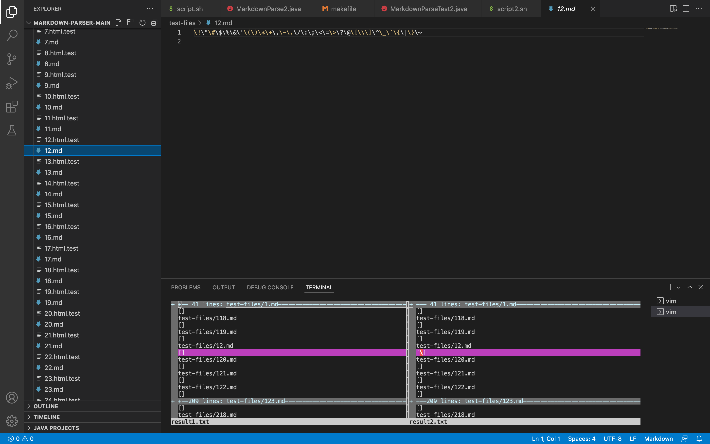
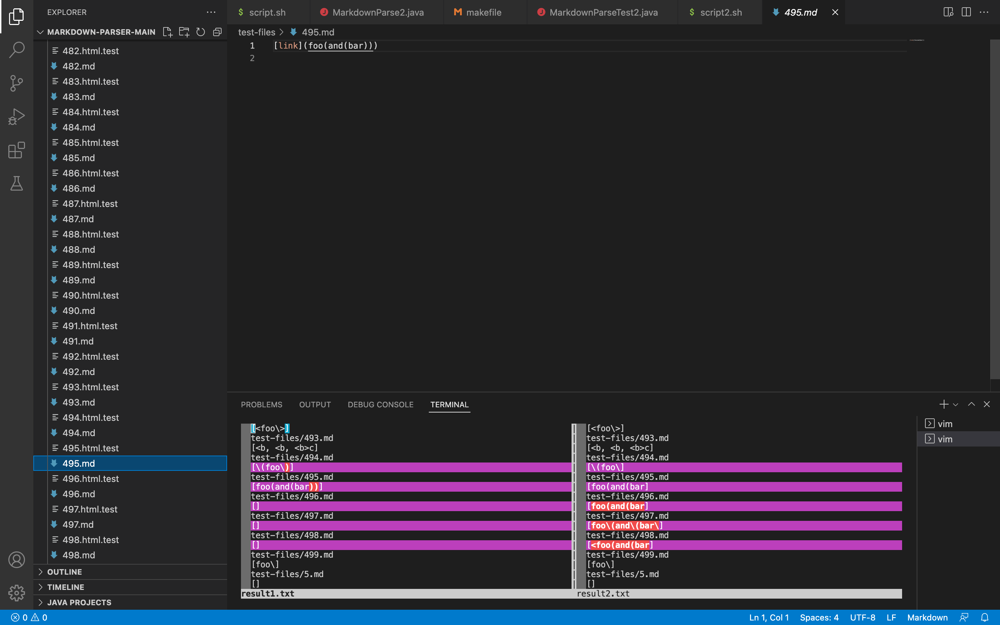
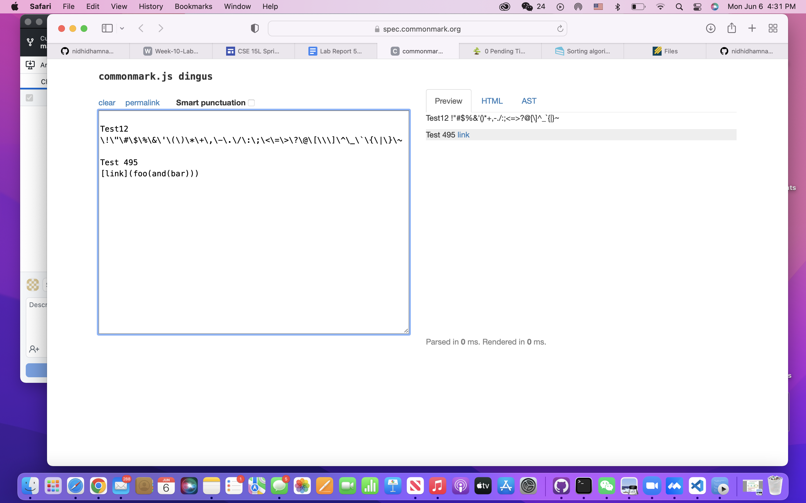

# Week-10-Lab-Report 

## How you found the tests with different results (Did you use vimdiff on the results of running a bash for loop? Did you search through manually? Did you use some other programmatic idea?)
I used vimdiff to find out the difference in the two outputs. First, I created `script2.sh` file for running my implementation of the MarkdownParse.java, and add a print statement in both of the files. Then I used `./script.sh > result.txt` to import both output to result1.txt and result2.txt respectively. Then I used `vimdiff result1.txt result2.txt` to compare the difference.

## Provide a link to the test-file with different-results (in the provided repository or your repository , either is fine)

## Test1-test12 and Test2-test495
### Describe which implementation is correct, or neither if both give the wrong output

### Indicate both actual outputs (provide screenshots) and also what the expected output is (list the links that are expected in the output).

