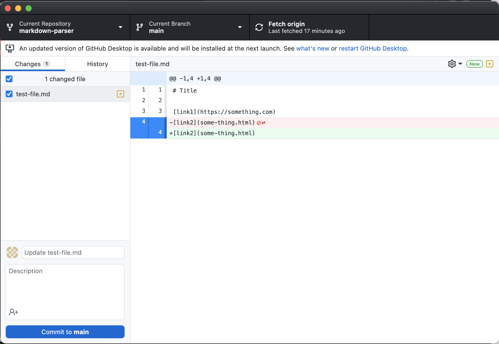
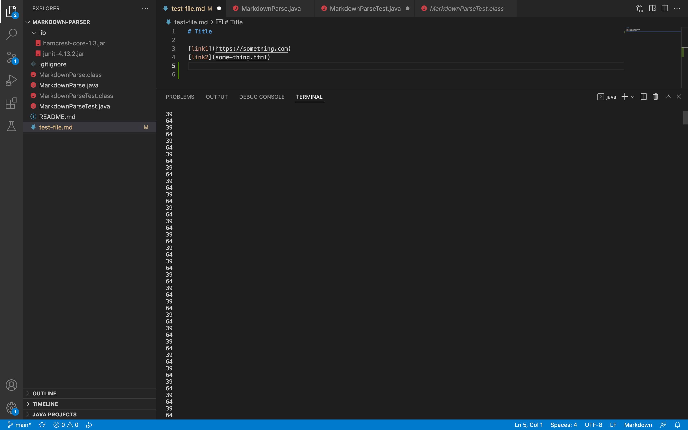
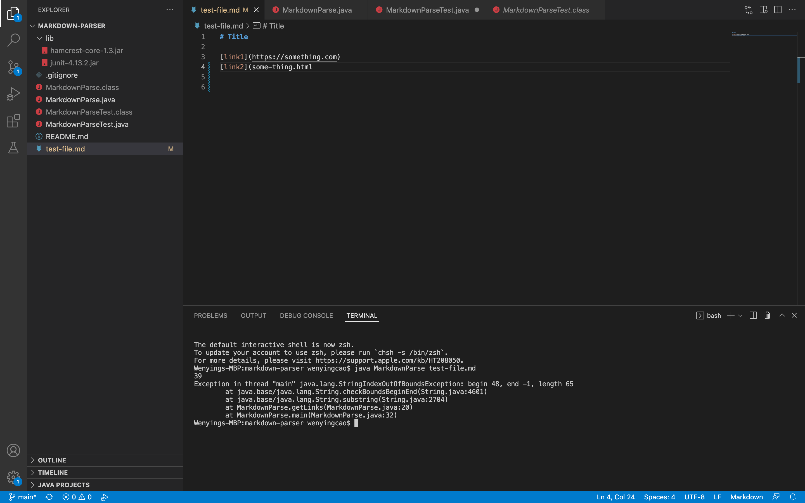
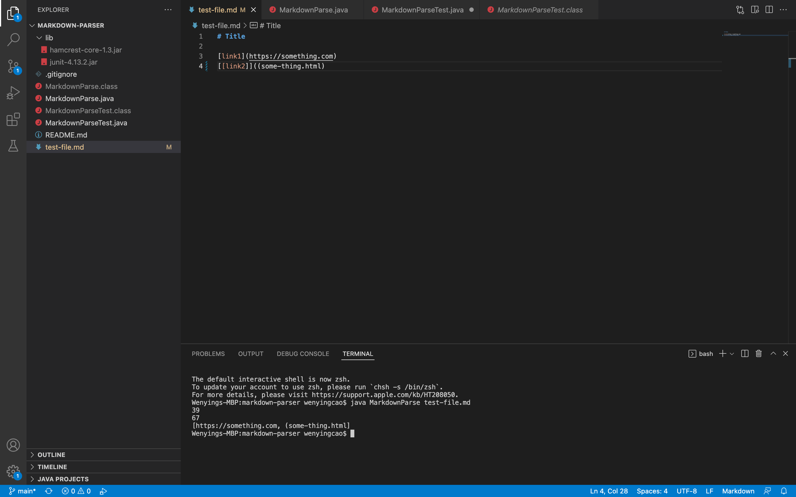
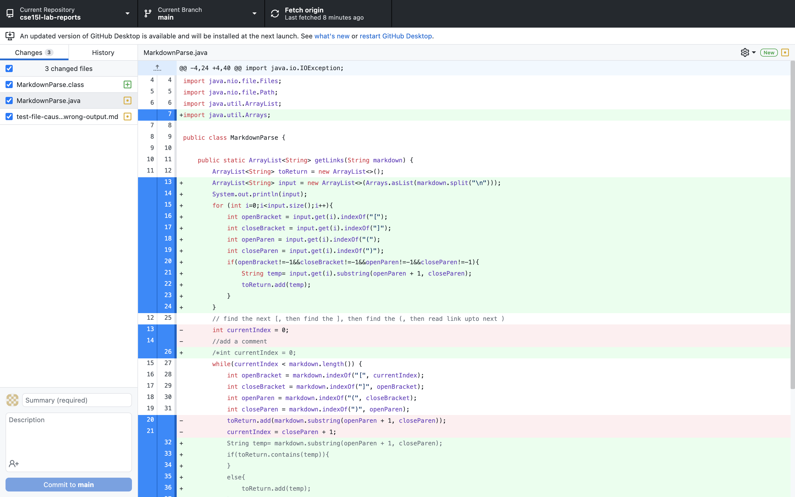
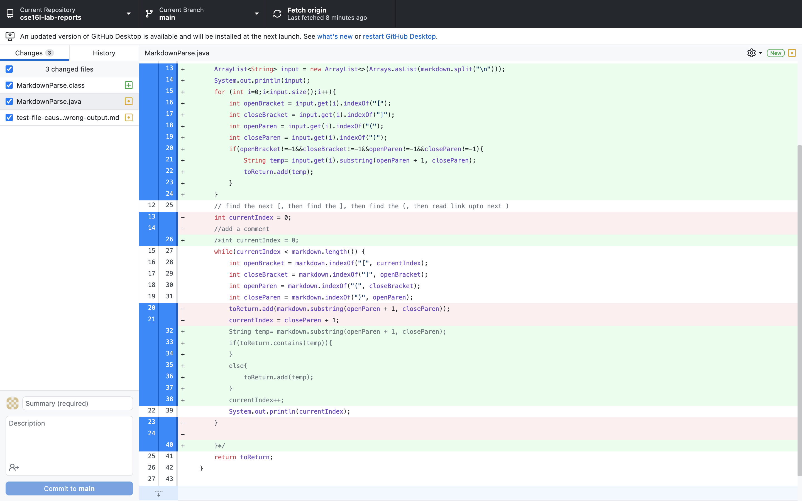

# Week-4-Lab-Report
## Github change diff
This following screenshot shows that when you change your code in github, there will be an indicator to show you have changed something.

## failure-inducing test-file
There are three test files that will cause three different kind of errors. 
1. [Link to test file that will cause infinite loop](test-file-cause-infinite-loop.md)
2. [Link to test file that will cause string out of bound exception](test-file-cause-stringOutOfBoundException.md)
3. [Link to test file that will cause wrong output](test-file-cause-wrong-output.md)
## infinite loop
This bug is caused by one additional new line in the test file, and the symptom is that the program would not stop running.

## out of bound exception
This bug is caused by missing ")" in the test file, and the symptom is that the program will not run.

## wrong output 
This bug is cause by additional "(" in the test file, and the symptom is that the program will give wrong result. 

## What I did for fix all the problems above?
What I did to fix is that I split the input string into an arrayList of string by the new line character, then in each element of arrayList, I look for the following characters, "(", ")", "[", "]". Form there, I only consider any line of input a valid input if I find all four characters. 

