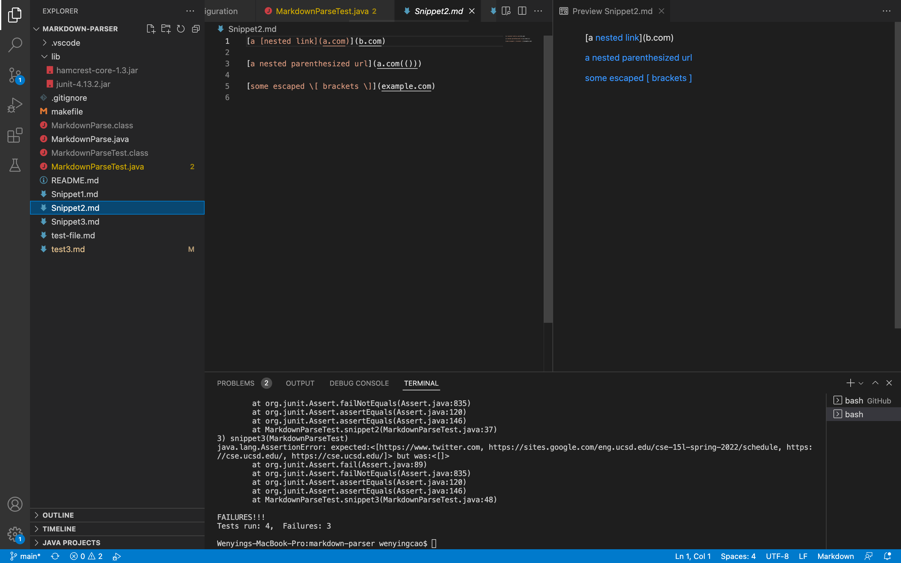

# Week 8 Lab Report 4
## A link to your markdown-parse repository and a link to the one you reviewed in week 7
This is my markdown parse reopsitory
[link](https://github.com/w1caoucsd/markdown-parser)

This is the markdown parse reopsitory that I reviewed
[link](https://github.com/NLChung9/markdown-parser)
### Decide on what it should produce (i.e., expected output) by using either VScode preview or the CommonMark demo site
Here are the preview using VScode.

This is using CommonMark demo site

### Showing the code in MarkdownParseTest.java for how you turned it into a test
This is my MarkdownParseTest.java and the test output.

### For your implementation, the corresponding output when running the tests; if it passed, say so. If it didn’t pass, show the specific part of the JUnit output that shows the test failure.

### For the implementation you reviewed in Week 7, the corresponding output when running the tests; if it passed, say so. If it didn’t pass, show the specific part of the JUnit output that shows the test failure.

## Answer the following questions with 2-3 sentences each:
### Do you think there is a small (<10 lines) code change that will make your program work for snippet 1 and all related cases that use inline code with backticks? If yes, describe the code change. If not, describe why it would be a more involved change.
I think there is a solution to the problem that can be within the length of 10 lines. I don't really know how to do it, but my idea is to make the program ignore whatever is inside of the backticks. Since my program is to look for the bracktes regardless of the backticks, so that the solution is to first scan to check if there is backticks. 

### Do you think there is a small (<10 lines) code change that will make your program work for snippet 2 and all related cases that nest parentheses, brackets, and escaped brackets? If yes, describe the code change. If not, describe why it would be a more involved change.
I think there is a solution to this problem that is small change. My code is looking for the first ")", but the correct answer should be looking for the last ")", but since I'm using the find method provided by Java, I need to rewrite a find method to find the particular index of the brackets. 

### Do you think there is a small (<10 lines) code change that will make your program work for snippet 3 and all related cases that have newlines in brackets and parentheses? If yes, describe the code change. If not, describe why it would be a more involved change.
I don't think I can solve this problem in a relativelly small amount of time, becasue the brackets are not in the same line, but it has to be in the same line for my code to detect it. My idea is to maybe look for a ")" when you see the "(" first and look for a "]" when you see "[" first. 

### If your code already works on some/all test cases, include an explanation of what were the code changes that allowed the tests to pass.
No. None of my code pass in the tests.
