# lab-report-3-week-6

## Streamlining ssh Configuration
### Show your .ssh/config file, and how you edited it (with VScode)
First, I accessed .ssh/config file by VScode. 
I did this by opening the `.ssh` file with VScode, it is on my computer if I do `wenyingcao$ ls -la`, I will get `wenyingcao  staff    192 Apr 28 14:50 .ssh`.
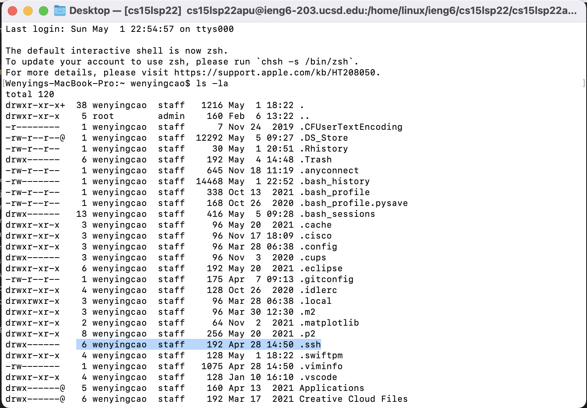
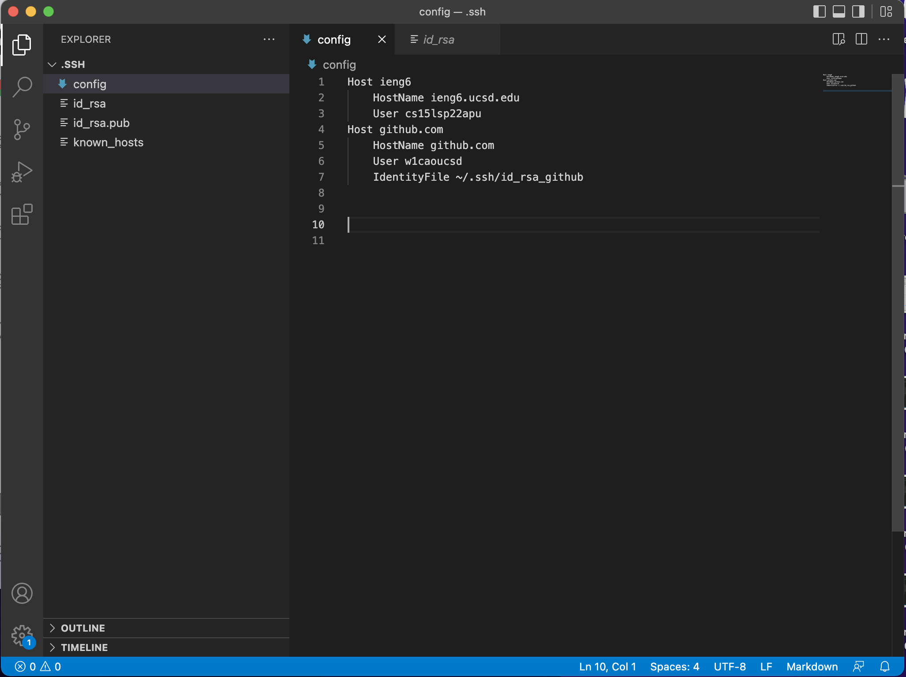
### Show the ssh command logging you into your account using just the alias you chose.
Second, I used ssh command to log into the server with just the alias.
After I set the key in my `.ssh` file, I can log into my ucsd server using only `ssh ieng6` without typing in the rest of my user name. 
### Show an scp command copying a file to your account using just the alias you chose.
Third, scp command copying a file to your account. I used the command `scp <filename> ieng6:~` to copy file from my local computer to the ucsd server. I highlighted how I did it in the screeshot, and then in logged into the server using the alias to check if the file copied successfully.
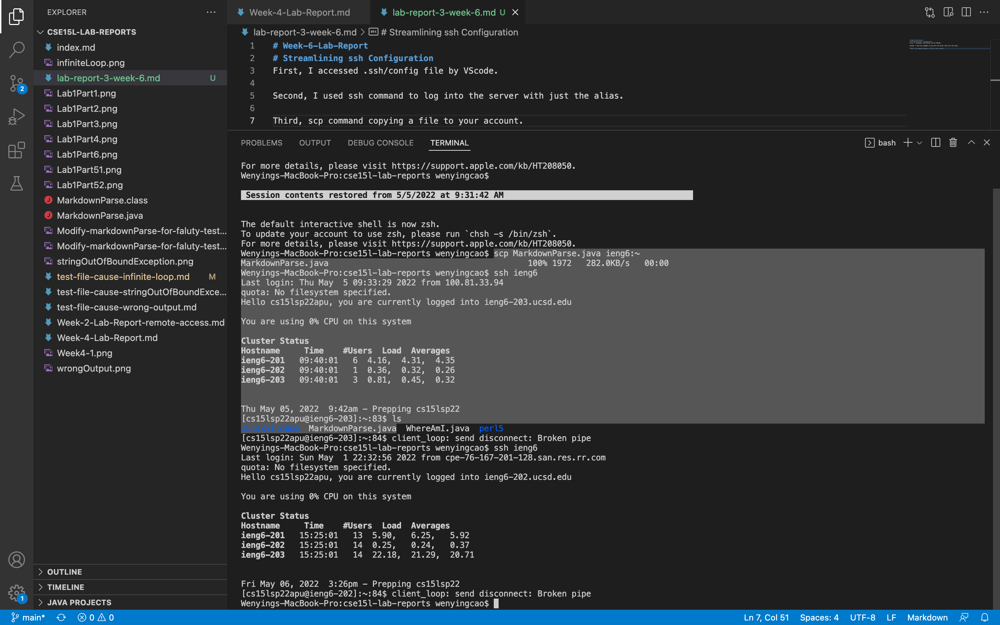

## Setup Github Access from ieng6
### Show where the public key you made is stored on Github and in your user account (screenshot).
First, I set up the private key in ucsd server by using the command `ssh-keygen`
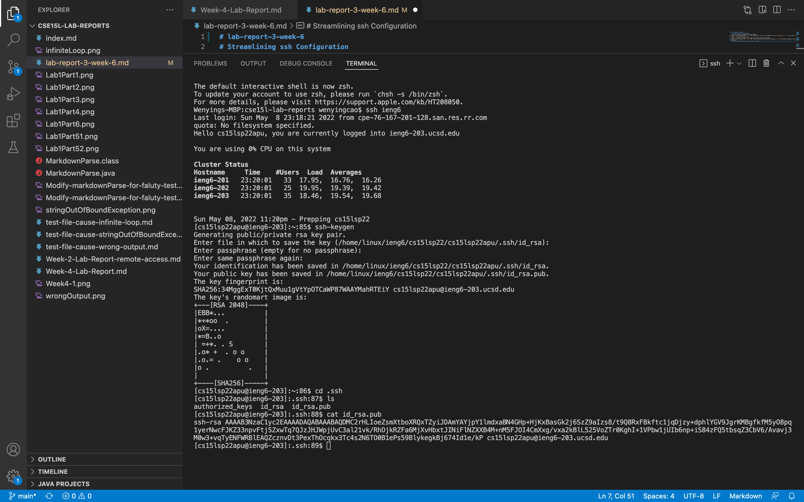
Then, I made use `ls` to see all the files to see where I stored the private key files. 
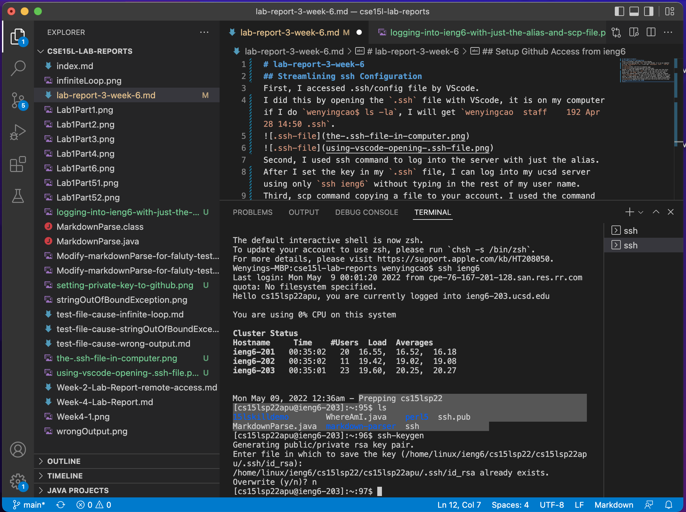
Then, I copied it to github, inside of the config file, there is a file called `id_rsa.pub`, this is where you public key stored.
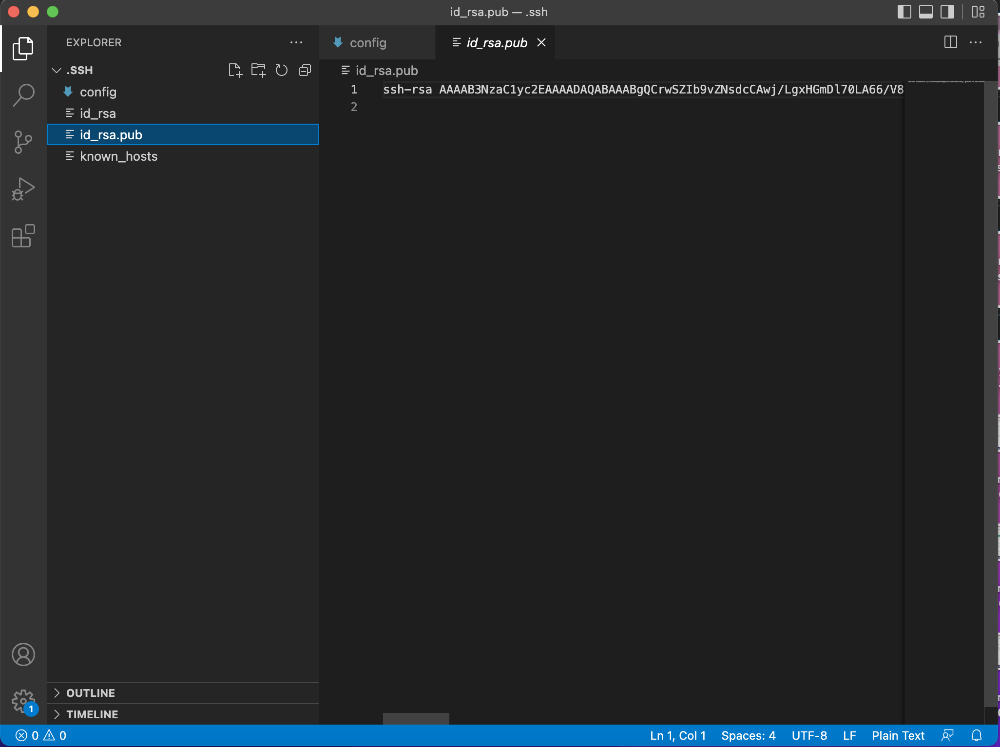

### Show where the private key you made is stored on your user account (but not its contents) as a screenshot.
The private key is stored at a file called `id_rsa` as the following screenshot.
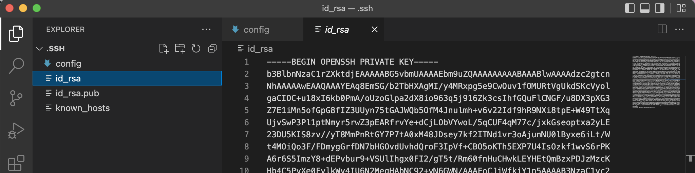
### Show running git commands to commit and push a change to Github while logged into your ieng6 account.
To access GitHub form a server like `ieng6`, there are couple steps you need to follow.
First, we want to clone a GitHub repository into the `ieng6`. After we set up the `ssh` key to our GitHub settings, we can clone the GitHub repository into the `ieng6` with the ssh link without actually typing in password. One thing to keep in mind is to use the corrct link, there are `HTTPS`, `SSH` and `GitHub CLI` links, remember to copy the `SSH` link as the screenshot show.
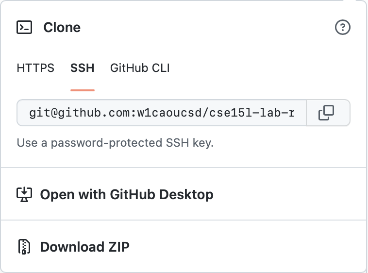
Thus, we want to use the command `git clone <SSH link>` as the following screenshot.
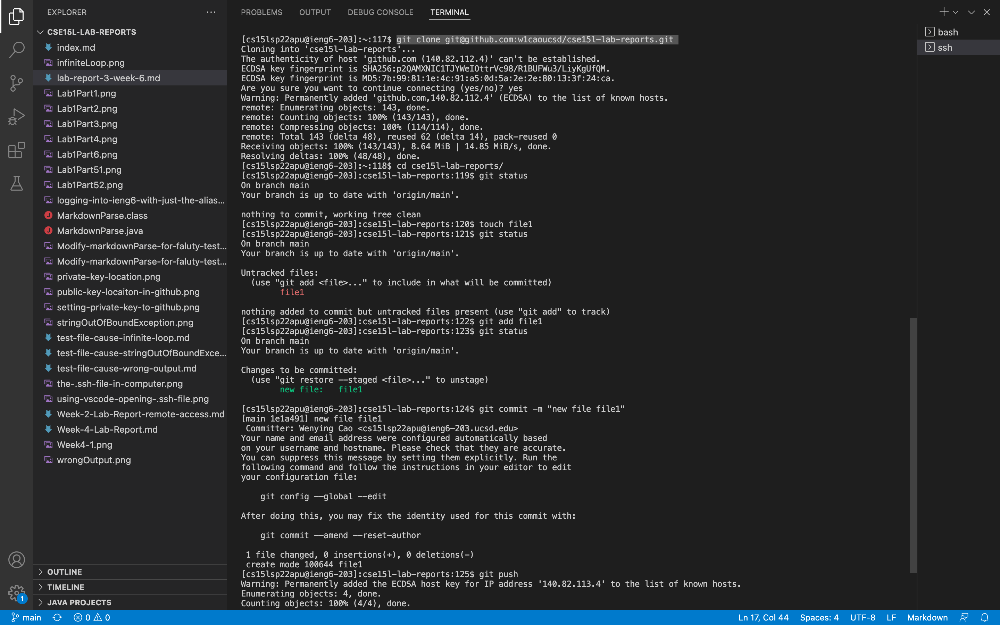
Second thing we want to do is make a change, we cannot push or commit anything if there is no changes made. Thus we want to use this command `touch <file name>` to create a new file, in this case, we created a new file called file1 as the screenshot shown.
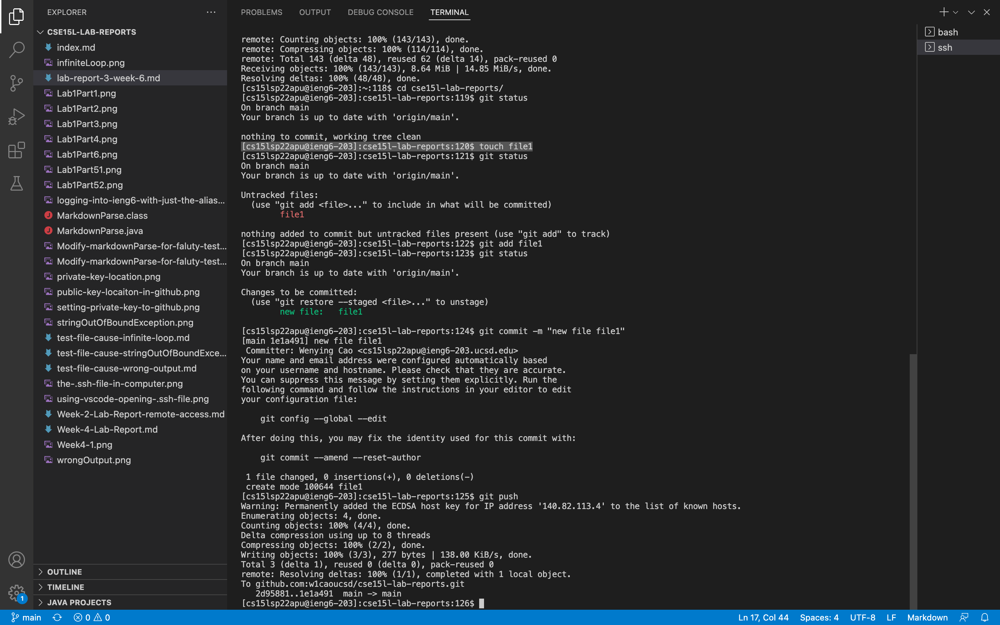
The thrid thing we want to do is to add this file using the command `git add <file name>`
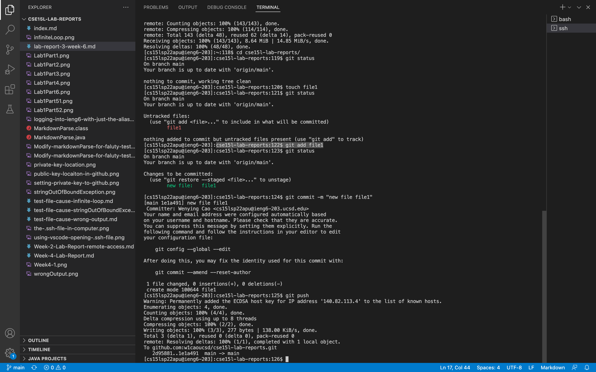
The fourth thing we want to do is that to commit the changes, which is adding a new file, to the local repository. Remember there are two different command `commit` and `push`, the difference is that commit is committing to the local repository, and push is pushing to the GitHub repository. There is also something worth notice is that we want to do `git commit -m "massage we want to sent"` to commit.
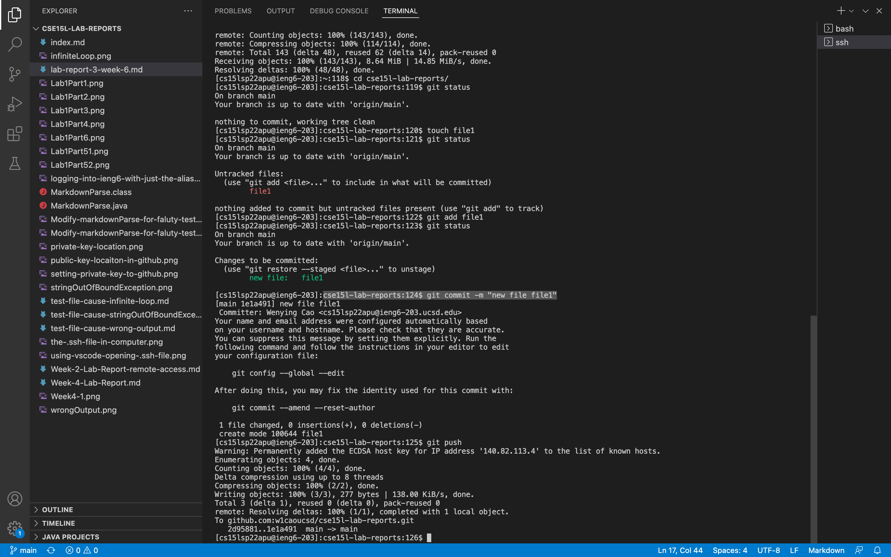
Then the last thing is to push to the GitHub repository. We want to use `git push` as shown.
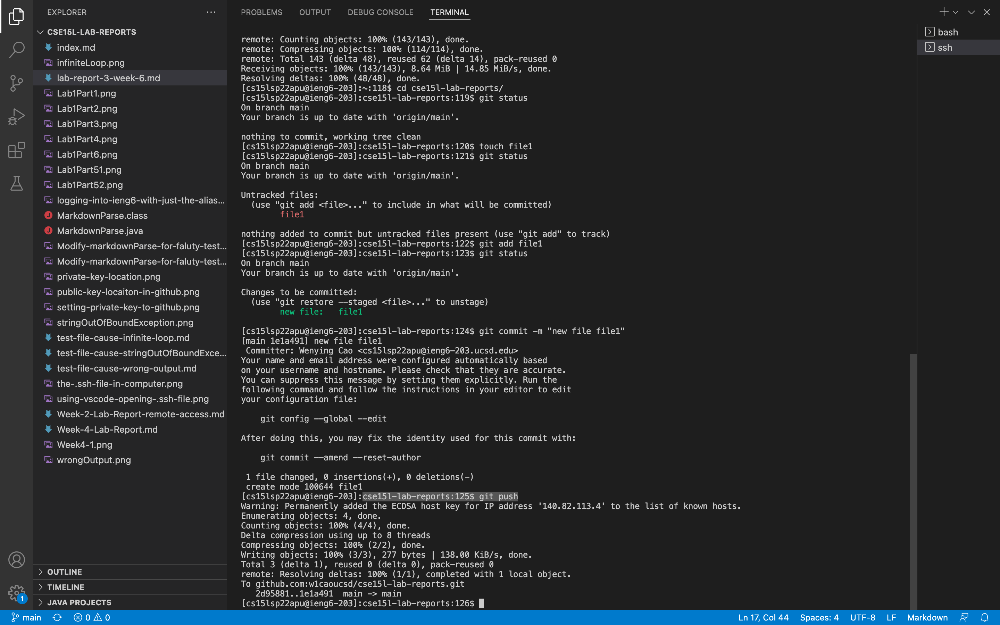
### Show a link for the resulting commit.
Now, if we log into our GitHub repository, we can see there is one new empty file called file1 in there. We can also see this using this link, [Here is the link  for the resulting commit](https://github.com/w1caoucsd/cse15l-lab-reports/commit/1e1a491642cb9d154120bffec9b665db5f384b62)
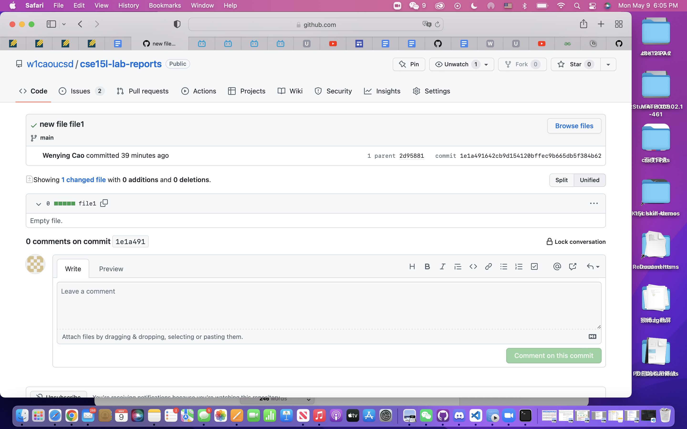

## Copy whole directories with scp -r
### Copying your whole markdown-parse directory to your ieng6 account.
I used this command `scp -r markdown-parser cs15lsp22apu@ieng6.ucsd.edu:.` to copy the markdown-parser directory to the home directory of my ieng6 account, `:.` means you want to copy it to the home directory.
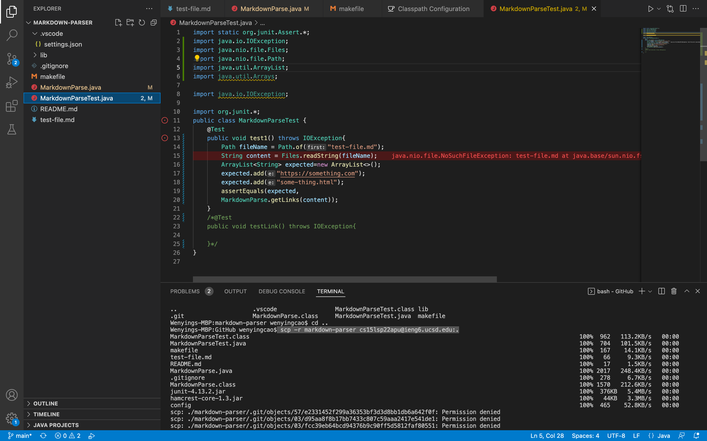

### logging into your ieng6 account after doing this and compiling and running the tests for your repository.
For this step, I first logged into my ieng6 account using `ssh ieng6` then I cd into markdown-parser by `cd markdown-parser/`, then compliled the code using `javac -cp .:lib/junit-4.13.2.jar:lib/hamcrest-core-1.3.jar MarkdownParseTest.java`, then ran the code using `java -cp .:lib/junit-4.13.2.jar:lib/hamcrest-core-1.3.jar org.junit.runner.JUnitCore MarkdownParseTest`. The following screenshot is the result.
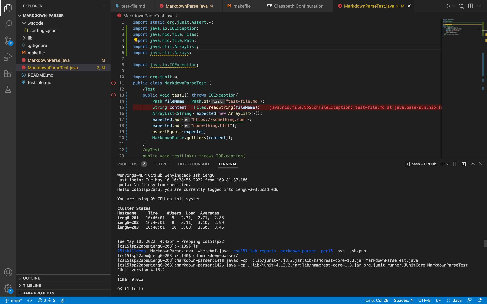
### combining scp, ;, and ssh to copy the whole directory and run the tests in one line.
lastly, I put all the commands together into one line `scp -r markdown-parser cs15lsp22apu@ieng6.ucsd.edu:.; ssh ieng6 "cd markdown-parser;/software/CSE/oracle-java-17/jdk-17.0.1/bin/javac -cp .:lib/junit-4.13.2.jar:lib/hamcrest-core-1.3.jar MarkdownParseTest.java;/software/CSE/oracle-java-17/jdk-17.0.1/bin/java -cp .:lib/junit-4.13.2.jar:lib/hamcrest-core-1.3.jar org.junit.runner.JUnitCore MarkdownParseTest"` and the results are as shown below. There was a small thing to notice is that I used to do this `scp -r markdown-parser cs15lsp22apu@ieng6.ucsd.edu:.; ssh ieng6 "cd markdown-parser;javac -cp .:lib/junit-4.13.2.jar:lib/hamcrest-core-1.3.jar MarkdownParseTest.java;java -cp .:lib/junit-4.13.2.jar:lib/hamcrest-core-1.3.jar org.junit.runner.JUnitCore MarkdownParseTest"` and it did not work. Then I replace the `javac` and `java` with `/software/CSE/oracle-java-17/jdk-17.0.1/bin/javac` and `/software/CSE/oracle-java-17/jdk-17.0.1/bin/java` respectively. Then this worked. 

