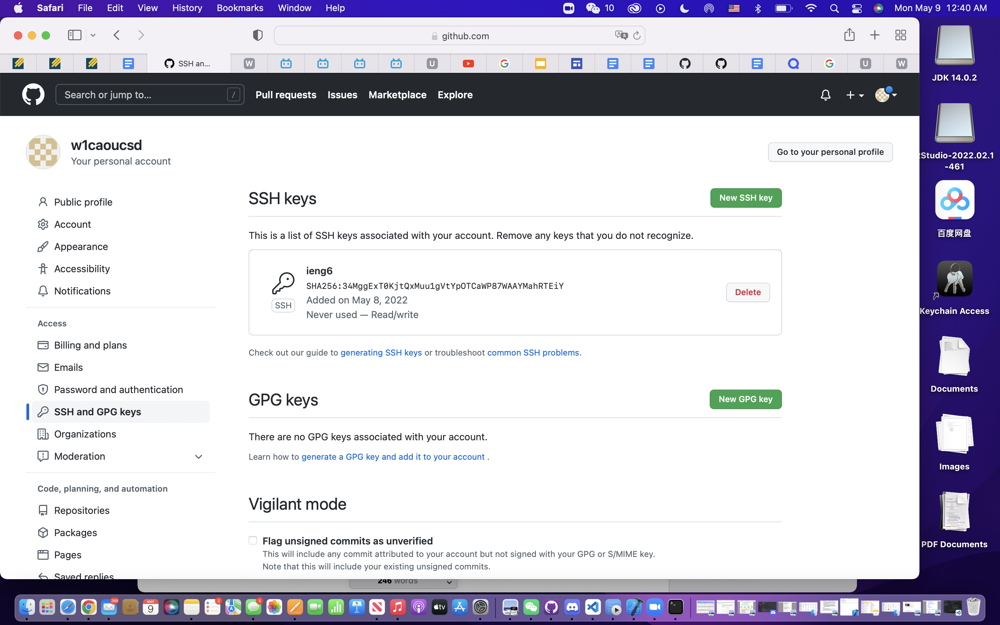

# lab-report-3-week-6
## Streamlining ssh Configuration
First, I accessed .ssh/config file by VScode. 
I did this by opening the `.ssh` file with VScode, it is on my computer if I do `wenyingcao$ ls -la`, I will get `wenyingcao  staff    192 Apr 28 14:50 .ssh`.

Second, I used ssh command to log into the server with just the alias.
After I set the key in my `.ssh` file, I can log into my ucsd server using only `ssh ieng6` without typing in the rest of my user name. 
Third, scp command copying a file to your account. I used the command `scp <filename> ieng6:~` to copy file from my local computer to the ucsd server. I highlighted how I did it in the screeshot, and then in logged into the server using the alias to check if the file copied successfully.

## Setup Github Access from ieng6
First, I set up the private key in ucsd server by using the command `ssh-keygen`

Then, I made use `ls` to see all the files to see where I stored the private key files. 

Then, I copied it to github
